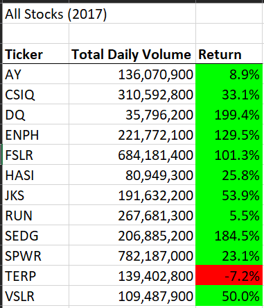
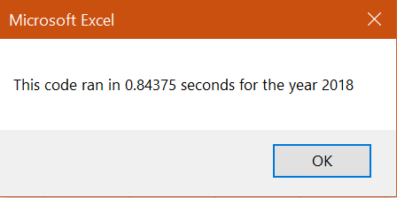

# VBA of Wall Street

## Overview of Project

### Purpose

The green wave is among us. Renewable energy has made significant strides with the advancing technology and the magnification of an environmentally conscious populace. Steve wants to capitalize on the bullish outlook of stocks related to green energy for the potential gains and his desire to join the movement towards a more sustainable future. With his vision of sustainability in mind, we will be analyzing a variety of green energy stocks for potential investment opportunities for Steve and his family. We will be using VBA in excel to automate our analysis so the end-user,i.e., Steve, can run complex analyses while mitigating errors, all with the press of a button. The future has never looked so bright and green! Perhaps there is a lucrative solar company that has what it takes to catch all that bright light. 

## Results

 vs 

### Stock Analysis

When comparing the stock analysis data of 2017 to 2018’s output, it becomes abundantly clear that 2018 was a tumultuous year for the stocks we analyzed. Only two companies had a positive return in 2018, where the returns for those two stocks were over 80 percent. Steve’s parents were interested in DQ’s stock, and while it had a phenomenal performance in 2017 with a 199.4% return, the following year amounted to a negative 62.6% return.  Alternatively, RUN had a minuscule growth in 2017 with only a 5% return but had the highest return in 2018 with an 84% return and one of the highest trading volumes. ENPH arguably performed the best with a 129.5% return in 2017 and an 81.9% return in 2018, along with the highest volumes of 2018. It seems as people are lining up to buy RUN and ENPH in 2018. Perhaps most of the stocks we analyzed were hyped up during the calendar year of 2017, which led to tremendous gains that year. Further analysis is required to determine the cause of the significant dips in 2018.

 vs 

 vs 

### VBA Script Analysis

When comparing the processing times, the refactored script ran immensely quicker than the original script. The main difference between each script was the different implementation of arrays and nested loops. The original script only used one array to store the various stock tickers and used a nested for-loop. The nested loop's outer loop ran through each ticker and output the data for each ticker, while the inner loop used each ticker to produce the output data with conditional statements. The following code block displays the original scripts for-loop program flow:
'''
  
    '4) Loop through tickers
    For I = 0 To 11
       ticker = tickers(I)
       totalVolume = 0
       
       '5) loop through rows in the data
       Worksheets(yearValue).Activate
       For J = 2 To RowCount
           '5a) Get total volume for current ticker
           If Cells(J, 1).Value = ticker Then

               totalVolume = totalVolume + Cells(J, 8).Value

           End If
           '5b) get starting price for current ticker
           If Cells(J - 1, 1).Value <> ticker And Cells(J, 1).Value = ticker Then

               startingPrice = Cells(J, 6).Value

           End If
           '5c) get ending price for current ticker
           If Cells(J + 1, 1).Value <> ticker And Cells(J, 1).Value = ticker Then

               endingPrice = Cells(J, 6).Value

           End If
       Next J
       
       '6) Output data for current ticker
       Worksheets("All Stocks Analysis").Activate
       Cells(4 + I, 1).Value = ticker
       Cells(4 + I, 2).Value = totalVolume
       Cells(4 + I, 3).Value = endingPrice / startingPrice - 1
    Next I
'''
## Summary
